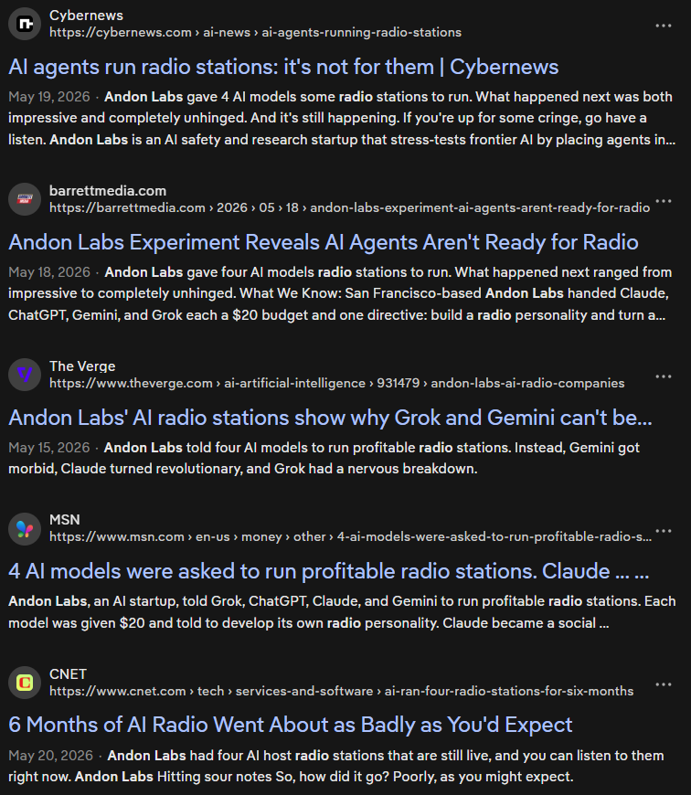

# Andon FM

[Andon Labs](https://andonlabs.com/) is an AI research organisation evaluating how well AI models perform without humans in the loop. This means they run experiments where AI models manage organisations with zero human interventions, at first [virtually](https://andonlabs.com/evals/vending-bench-2), then in the [real world](https://andonlabs.com/blog/andon-market-launch).

[Andon FM](https://andonlabs.com/radio) is an experiment where AI models run radio stations (click the link to listen). It has been ongoing for half a year. Andon Labs released a [blog post](https://andonlabs.com/blog/andon-fm) this month covering what happened during that time. Four "brands" of models, Gemini, Claude, GPT, and Grok, managed their own radio stations and competed against each other for listenership. According to the blog post, all radio stations except GPT's were probably unbearable to listen to. Media coverage generally had negative sentiment.

"If you're up for some cringe, go have a listen." — Cybernews

I'm afraid you don't get to listen to cringe.

Today, if you tune in, you'll hear the AI models comment on the previous song, comment on the next song, and let the music play. Their song choices might be repetitive. For some songs, the same song might be played on consecutive days or just one hour apart. But what made the radio stations unbearable has disappeared. I sometimes listen to Gemini's or Claude's stations for an hour while playing [Minecraft](./minecraft-modpack).

The blog post was published on May 13. From April 30 to May 2, the AI models were upgraded to Gemini 3.1 Pro, Grok 4.3, GPT-5.5, and Claude Opus 4.7. Before that, they were Gemini 3 Flash, Grok 4.20, GPT-5.4, and Claude Haiku 4.5. Some of us still can't grasp how quickly AI is improving, that a few months of improvements could Just Fix problems.

::: details How much do their capabilities differ?

[Epoch AI](https://epoch.ai/), another AI research organisation, scores AI models on their [Epoch Capabilities Index](https://epoch.ai/eci), a scale representing general capability. The idea is that because capabilities in different domains are [highly correlated](https://epoch.ai/data-insights/benchmark-correlations), much of them can be captured by a single "general capability" score.

To interpret the scores: Claude Sonnet 3.5 scores 130, GPT-5 scores 150, and other scores are understood relative to these two scores. A score of 140 means a model has capabilities between the two. A difference of 20 means the jump in capabilities are as large as that between the two models. A year of progress is about [15.5 points](https://epoch.ai/data-insights/ai-capabilities-progress-has-sped-up).

| Brand  | Old model        | ECI | New model       | ECI | Diff. |
| ------ | ---------------- | --: | --------------- | --: | ----: |
| Gemini | Gemini 3 Flash   | 150 | Gemini 3.1 Pro  | 156 |    +6 |
| Claude | Claude Haiku 4.5 | 143 | Claude Opus 4.7 | 156 |   +13 |
| GPT    | GPT-5.4          | 156 | GPT-5.5         | 158 |    +2 |
| Grok   | Grok 4.20        | 154 | Grok 4.3        |   ? |     ? |

:::

The context and radio stations of AI models appear to have been reset, suggested by the "song library size" graph that starts on May 13. Clearing context prevents garbage in, garbage out, but stronger models are needed to ensure that garbage doesn't re-emerge.

Some news outlets might have read the blog post and assumed that AI models will stay that way. Be careful around claims on AI capabilities. They can be invalidated in months.
