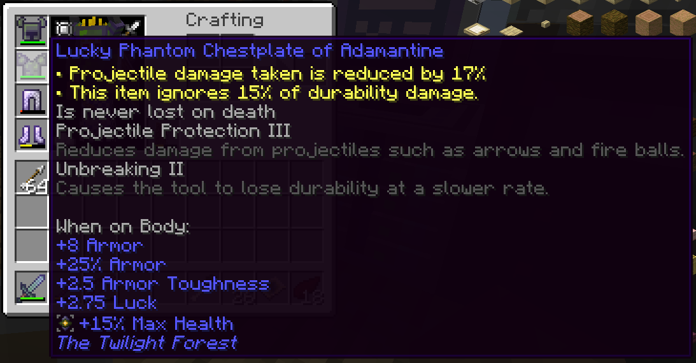
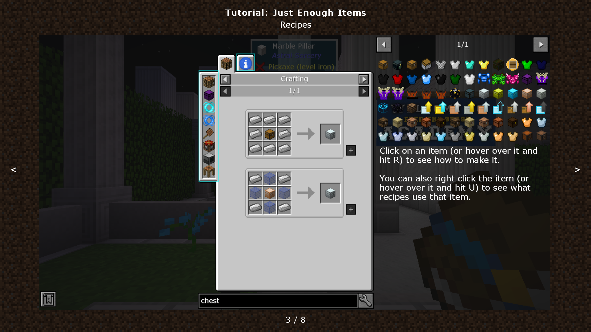
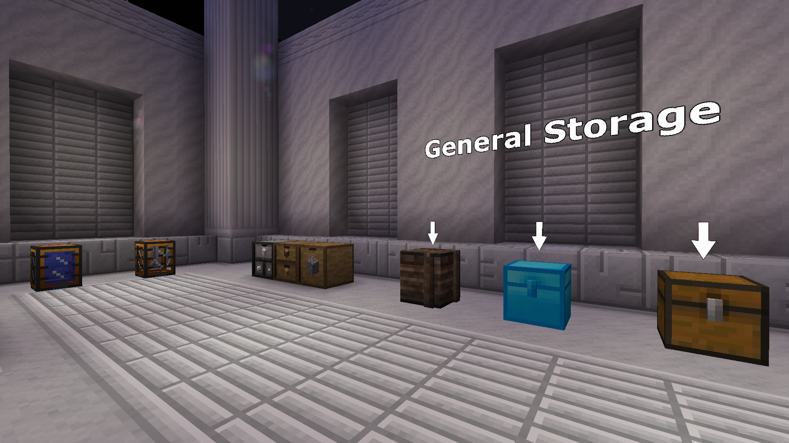

# Minecraft modpack

[minghinshi's Adventure](https://www.curseforge.com/minecraft/modpacks/minghinshis-adventure) is a Minecraft modpack that I have made and am updating. It focuses on the role-playing game (RPG) aspect of Minecraft. Progression is divided into five [World Tiers](https://www.curseforge.com/minecraft/mc-mods/apotheosis). A higher World Tier has harder enemies and objectives. In return, it offers more powerful tools and armour.

- Explore the classic [Twilight Forest](https://www.curseforge.com/minecraft/mc-mods/the-twilight-forest) dimension.
- Battle fierce bosses from the mod [Cataclysm](https://www.curseforge.com/minecraft/mc-mods/lendercataclysm).
- Put your strategic thinking to the test in the final challenge where enemy health and attack scale into the thousands. It's doable. I beat the modpack from start to finish.

The next update will feature 5 more dimensions and progression that feels tighter. After that, I'll probably refrain from making large content updates.

## What is a modpack?

Minecraft, contestably the game with the most copies sold, also likely has the largest modding scene. "Mod" is short for "modification". A mod is a player-made modification that introduces new code to the game, which means anything from minor tweaks to major overhauls. (It sometimes means malware. The community screens mods for malicious code, prevents players from downloading them, and releases patches to fix vulnerabilities.)

A modpack is a collection of mods and additional tweaks that make the mods work well together. For example, in terms of balance, mod X might be more powerful than other mods. Say, it adds a feature that gets you hundreds of diamonds quickly. Players would be discouraged from using diamond-generating features from other mods. A modpack would probably make mod X weaker.

You can browse and upload modpacks in [Modrinth](https://modrinth.com/) and [CurseForge](https://www.curseforge.com/minecraft). You can download and play modpacks in [Prism Launcher](https://prismlauncher.org/). There are many other modpack hosts and launchers, but these are likely the most popular ones. You need to buy Minecraft before playing mods.

## Motivation

The modpack started as an attempt to encourage my friends to play modded Minecraft. [FTB Academy](https://www.feed-the-beast.com/modpacks/88-ftb-academy-116) is a modpack designed to introduce new players to modded Minecraft. I started a server, and we played it. However, my friends soon stopped playing. One found the energy system introduced by technology mods too confusing, and the other found the sense of progression lacking.

This brings us to several problems with modpacks that I'd like to address. The first is a lack of sense of direction. FTB Academy and many other modpacks do not modify existing progression in mods. Because most mods are balanced based on vanilla Minecraft, and because you can reach the Nether or even the End in a few hours, the result is that dozens of mods are available after a few hours of gameplay, potentially overwhelming the player. Despite most major modpacks having [quests](https://www.curseforge.com/minecraft/mc-mods/ftb-quests-forge) showing where you are in progression and what you can do next, the sheer number of options becomes paralysing.

To solve this problem, many modpacks alter crafting recipes or otherwise lock mods behind other mods. For example, crafting mod Y's item may require mod X's item, which can only be obtained after enough progression in mod X. Modpacks that do this are often expert modpacks, such as [Enigmatica 2: Expert](https://www.curseforge.com/minecraft/modpacks/enigmatica2expert), [Nomifactory](https://www.curseforge.com/minecraft/modpacks/nomi-ceu), and [Divine Journey 2](https://www.curseforge.com/minecraft/modpacks/divine-journey-2). They usually present hundreds of hours of difficult engineering challenges akin to [Factorio](https://www.factorio.com/).

Expert modpacks have their own problems. The second problem I want to address is a lack of challenge. I mean, it's not trivial to piece together components to design a system that automates something. However, once you figure out how to work with [Applied Energistics 2](https://www.curseforge.com/minecraft/mc-mods/applied-energistics-2), the problem is mostly reduced to replicating a working setup. And you need to do this for hundreds of hours.

This problem is exacerbated by gameplay that doesn't mesh well with Minecraft's user interface. This causes repetitive actions like moving items between inventory and storage, as well as configuring machines by pressing the same dozen buttons. I noticed it after playing Factorio and returning to Nomifactory. In Factorio, you can hold shift and click to copy and paste machine configs. Later in the game, you can copy sections of your factory and instruct robots to build a replica, including the configs. In Nomifactory (and Divine Journey 2), about a dozen tools were commonly used, some for mining, some for travelling around the base, one tool for one different kind of config. No, the [Morph-o-Tool](https://www.curseforge.com/minecraft/mc-mods/morph-o-tool) felt clumsy to use, so it didn't help.

The third problem is a tall barrier to entry. Almost all modpacks assume that you know how to use [Just Enough Items](https://www.curseforge.com/minecraft/mc-mods/jei) (JEI) or how energy systems work, but that's not true for new players of modded Minecraft. As a result, it is difficult to learn by doing. FTB Academy was designed to solve this problem. In [FTB Academy 1.12](https://www.feed-the-beast.com/modpacks/1-ftb-academy-112) (my friends and I played FTB Academy 1.16 instead), you start in a school and go through an interactive tutorial before you land in the Minecraft world and the run officially starts. Right away, the modpack teaches how to view quests and use JEI.

However, as mentioned, FTB Academy doesn't balance progression. I was basically looking for FTB Academy but with balanced progression. I couldn't find one, so I'm making one. The vision has changed since then, but challenge and approachability remain principles.

The large number of mods makes modded Minecraft even less approachable. Not only is gameplay overwhelming, modpacks also become very resource-hungry. Almost all popular modpacks have at least 200 mods and use at least 6 GB of memory.
